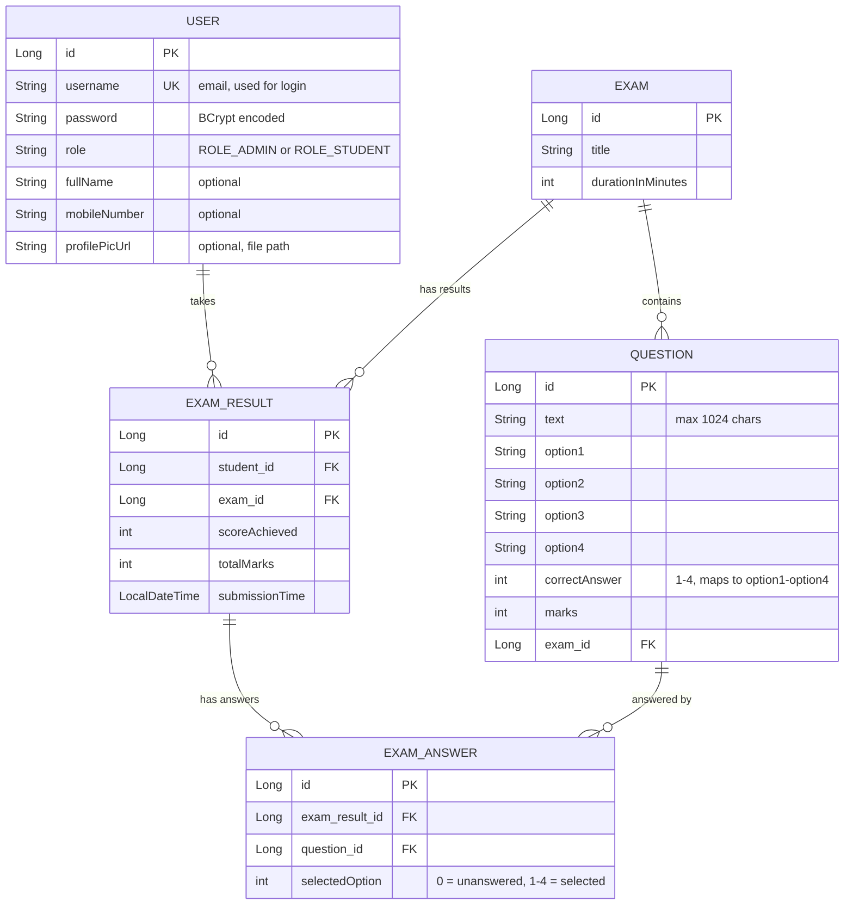

# Online Exam System — Complete Project Documentation

> **Purpose:** This document describes every feature, component, and logical flow in the Online Exam System so that any developer or AI model can fully understand the project.

---

## 1. Technology Stack

| Layer | Technology |
|-------|-----------|
| **Framework** | Spring Boot 3.2.0 (Java 17) |
| **Template Engine** | Thymeleaf |
| **Database** | H2 (file-based, stored in `./data/examdb.mv.db`) |
| **ORM** | Spring Data JPA / Hibernate |
| **Security** | Spring Security with BCrypt password encoding |
| **Frontend** | Bootstrap 5.3.2, Bootstrap Icons, vanilla JavaScript |
| **Build Tool** | Maven (with Maven Wrapper `mvnw.cmd`) |
| **File Storage** | Local filesystem (`./uploads/` directory) |

---

## 2. Project Structure

```
src/main/java/com/example/exam/
├── OnlineExamApplication.java        # Main Spring Boot entry point
├── config/
│   ├── SecurityConfig.java           # Spring Security rules & filter chain
│   ├── CustomAuthSuccessHandler.java # Role-based redirect after login
│   ├── DataInitializer.java          # Seeds default admin on first startup
│   ├── GlobalControllerAdvice.java   # Injects current user into all templates
│   └── MvcConfig.java               # Static resource and upload path mapping
├── controller/
│   ├── AuthController.java           # Login, register, home page routing
│   ├── AdminController.java          # All admin CRUD operations (24 endpoints)
│   ├── StudentController.java        # Student dashboard, profile, results
│   ├── ExamController.java           # Take exam and submit answers
│   └── ReviewController.java         # Review submitted answers
├── model/
│   ├── User.java                     # User entity (admin + student)
│   ├── Exam.java                     # Exam entity
│   ├── Question.java                 # Question entity (MCQ with 4 options)
│   ├── ExamAnswer.java               # Individual answer per question
│   └── ExamResult.java               # Overall result for an exam attempt
├── repository/
│   ├── UserRepository.java
│   ├── ExamRepository.java
│   ├── QuestionRepository.java
│   ├── ExamAnswerRepository.java
│   └── ExamResultRepository.java
└── service/
    ├── UserService.java              # Interface for user operations
    ├── UserServiceImpl.java          # Saves students and admins with roles
    ├── CustomUserDetailsService.java # Loads users for Spring Security
    └── FileStorageService.java       # Handles profile picture uploads

src/main/resources/
├── application.properties            # Port, DB config, JPA settings
├── templates/
│   ├── index.html                    # Landing page (public)
│   ├── login.html                    # Login form
│   ├── register.html                 # Student registration form
│   ├── fragments.html                # Reusable navbar fragment
│   ├── admin/                        # 11 admin templates
│   │   ├── dashboard.html
│   │   ├── manage_exams.html
│   │   ├── add_exam.html
│   │   ├── edit_exam.html
│   │   ├── add_question.html
│   │   ├── edit_question.html
│   │   ├── manage_questions.html
│   │   ├── view_results.html
│   │   ├── manage_students.html
│   │   ├── manage_admins.html
│   │   └── add_admin.html
│   └── student/                      # 6 student templates
│       ├── dashboard.html
│       ├── exam_page.html
│       ├── result.html
│       ├── review_exam.html
│       ├── my_results.html
│       └── profile.html
```

---

## 3. Database Schema (Entity Relationships)



---

## 4. Security & Authentication

### 4.1 Spring Security Configuration (`SecurityConfig.java`)

- **Password Encoding:** BCrypt via `BCryptPasswordEncoder`
- **CSRF:** Disabled (for simplicity with H2 console)
- **URL Access Rules:**
  - **Public (no login required):** `/`, `/login`, `/register`, `/h2-console/**`, static resources (`/js/**`, `/css/**`, `/images/**`, `/uploads/**`)
  - **Admin only:** `/admin/**` requires `ROLE_ADMIN`
  - **Student only:** `/student/**`, `/exam/**` requires `ROLE_STUDENT`
  - **Everything else:** requires authentication
- **Login:** Custom login page at `/login`, processes at `/login`, failure redirects to `/login?error=true`
- **Logout:** Via `/logout` (uses `AntPathRequestMatcher`)
- **H2 Console:** Frame options disabled to allow H2 console iframe

### 4.2 Role-Based Redirect After Login (`CustomAuthSuccessHandler.java`)

After successful login:
- `ROLE_ADMIN` → redirected to `/admin/dashboard`
- `ROLE_STUDENT` → redirected to `/student/dashboard`
- Unknown role → falls back to `/login?error=true`

### 4.3 User Authentication (`CustomUserDetailsService.java`)

- Implements Spring Security's `UserDetailsService`
- Loads user by `username` (which is the email) from the database
- Maps the user's single role string to a `GrantedAuthority`

### 4.4 Default Admin Seeding (`DataInitializer.java`)

On application startup:
1. Checks if any user with `ROLE_ADMIN` exists
2. If none found, creates a default admin with a preconfigured username and password (see `DataInitializer.java` for details)
3. The default credentials are printed to the console on first run
4. On subsequent startups, skips seeding if an admin already exists

### 4.5 Global Controller Advice (`GlobalControllerAdvice.java`)

- Injects `currentUser` (the `User` object) into all Thymeleaf templates via `@ModelAttribute`
- Used by the navbar to display the user's name and profile picture

---

## 5. User Roles & Registration

### Two Roles

| Role | Value | Access |
|------|-------|--------|
| Admin/Teacher | `ROLE_ADMIN` | Full platform management |
| Student | `ROLE_STUDENT` | Take exams, view results, manage profile |

### Student Registration (`AuthController.registerStudent`)

**Route:** `POST /register`

1. Validates that the email (username) is unique
2. If a profile picture file is uploaded, saves it via `FileStorageService` and stores the path
3. Calls `userService.saveStudent(user)` which:
   - Sets role to `ROLE_STUDENT`
   - Encodes password with BCrypt
   - Saves to database
4. Redirects to `/register?success`

### Admin Creation (`AdminController.addAdmin`)

**Route:** `POST /admin/admins/add`

1. Validates email uniqueness
2. Calls `userService.saveAdmin(user)` which:
   - Sets role to `ROLE_ADMIN`
   - Encodes password with BCrypt
   - Saves to database
3. Redirects to `/admin/manage-admins` with success message

---

## 6. Features & Logic — Admin Side

### 6.1 Admin Dashboard (`GET /admin/dashboard`)

Displays aggregated statistics:
- Total exams (`examRepository.count()`)
- Total questions (`questionRepository.count()`)
- Total students (`userRepository.countByRole("ROLE_STUDENT")`)
- Total exam attempts (`examResultRepository.count()`)
- Recent 5 results with student names, scores, and percentages
- Quick action links to manage exams, students, admins, and create new exams

### 6.2 Exam Management

| Action | Route | Method | Logic |
|--------|-------|--------|-------|
| List all exams | `GET /admin/manage-exams` | `getManageExamsPage` | Lists all exams from `examRepository.findAll()` |
| Show add form | `GET /admin/add-exam` | `showAddExamForm` | Returns empty `Exam` model |
| Create exam | `POST /admin/add-exam` | `addExam` | Saves exam with title and duration |
| Show edit form | `GET /admin/edit-exam/{examId}` | `showEditExamForm` | Loads exam by ID |
| Update exam | `POST /admin/edit-exam/{examId}` | `updateExam` | Updates title and duration of existing exam |
| Delete exam | `GET /admin/delete-exam/{examId}` | `deleteExam` | Deletes exam and cascades to questions/results |

### 6.3 Question Management

| Action | Route | Method | Logic |
|--------|-------|--------|-------|
| List questions for exam | `GET /admin/exam/{examId}/questions` | `showManageQuestionsPage` | Lists all questions for a specific exam |
| Show add form | `GET /admin/exam/{examId}/add-question` | `showAddQuestionForm` | Shows form with exam context |
| Add question | `POST /admin/add-question` | `addQuestion` | Links question to exam, saves all 4 options + correct answer + marks |
| Show edit form | `GET /admin/edit-question/{questionId}` | `showEditQuestionForm` | Loads question by ID |
| Update question | `POST /admin/edit-question/{questionId}` | `updateQuestion` | Updates text, options, correct answer, marks; preserves exam link |
| Delete question | `GET /admin/exam/{examId}/delete-question/{questionId}` | `deleteQuestion` | Removes question from exam, deletes from DB |

**Question Model Details:**
- Each question has exactly 4 options (`option1` through `option4`)
- `correctAnswer` is an integer (1-4) mapping to the option number
- Each question has a `marks` value (weighted scoring)

### 6.4 Student Management

| Action | Route | Method | Logic |
|--------|-------|--------|-------|
| List students | `GET /admin/manage-students` | `getManageStudentsPage` | Lists all users with `ROLE_STUDENT` |
| Delete student | `GET /admin/delete-student/{id}` | `deleteStudent` | Deletes all exam results first, then deletes student |
| Reset password | `POST /admin/reset-student-password` | `resetStudentPassword` | Encodes new password with BCrypt and saves |

**Delete Student Logic (important cascade order):**
1. Find student by ID
2. Delete all `ExamResult` records for the student (`examResultRepository.deleteByStudent`)
3. Delete the student user record
4. Redirect with success/error flash message

### 6.5 Admin/Teacher Management

| Action | Route | Method | Logic |
|--------|-------|--------|-------|
| List admins | `GET /admin/manage-admins` | `getManageAdminsPage` | Lists all users with `ROLE_ADMIN` |
| Show add form | `GET /admin/admins/add` | `showAddAdminForm` | Returns form with empty `User` model |
| Create admin | `POST /admin/admins/add` | `addAdmin` | Validates email uniqueness, saves with `ROLE_ADMIN` |
| Delete admin | `GET /admin/delete-admin/{id}` | `deleteAdmin` | Deletes admin with protection rules (see below) |
| Reset password | `POST /admin/reset-admin-password` | `resetAdminPassword` | Encodes new password with BCrypt |

**Admin Deletion Protection (`deleteAdmin`):**
1. **Self-deletion prevention:** Cannot delete your own account (checked via current authentication)
2. **Main admin protection:** Cannot delete `admin@exam.com` (the seeded super-admin)
3. If neither restriction applies, deletes all exam results then deletes the user
4. **UI Protection:** The delete button is hidden for `admin@exam.com` (shows a "Protected" badge instead)
5. **Delete Confirmation:** Uses a Bootstrap modal instead of native `confirm()` for reliability

### 6.6 View Exam Results

**Route:** `GET /admin/exam/{examId}/results`

- Loads all `ExamResult` records for the exam
- Calculates percentage for each result: `(scoreAchieved * 100) / totalMarks`
- Displays student name, score, percentage, and submission time

---

## 7. Features & Logic — Student Side

### 7.1 Student Dashboard (`GET /student/dashboard`)

Displays personalized analytics:
- **Welcome message** with student's name
- **Stats cards:**
  - Total exams available
  - Exams completed (distinct exams taken)
  - Average score (percentage across all attempts)
- **Available exams list** with "Start Exam" buttons
- **Recent results** showing score, percentage, and review links
- **Performance chart** (bar chart or visual representation of scores)

**Logic for "Exams Completed":**
```
completedExamIds = examResults.stream()
    .map(result -> result.getExam().getId())
    .collect(Collectors.toSet());
examsTaken = completedExamIds.size();
```

**Logic for "Average Score":**
```
averageScore = results.stream()
    .mapToDouble(r -> (r.getScoreAchieved() * 100.0) / r.getTotalMarks())
    .average()
    .orElse(0.0);
```

### 7.2 Taking an Exam (`GET /exam/{examId}`)

1. Loads the exam and all its questions
2. Passes student info, exam details, and questions to the template
3. **Frontend exam page** (`exam_page.html`):
   - Displays a countdown timer based on `exam.durationInMinutes`
   - Shows one question at a time with radio buttons for 4 options
   - Navigation panel to jump between questions
   - **Auto-submit** when timer hits zero (JavaScript submits the form automatically)
   - Manual "Submit Exam" button with confirmation

### 7.3 Submitting an Exam (`POST /exam/submit`)

**Scoring Logic (step by step):**

1. Get the authenticated student and exam
2. Create an `ExamResult` object and save it (to get an ID)
3. Loop through all questions in the exam:
   - Check if the student submitted an answer (key format: `q_{questionId}`)
   - Parse the selected option (default 0 if unanswered)
   - If `selectedOption == question.correctAnswer`, add `question.marks` to score
   - Create an `ExamAnswer` record for each question (even unanswered ones)
4. Update the `ExamResult` with final `scoreAchieved` and `totalMarks`
5. Redirect to `/student/result` with score, total, and resultId as flash attributes

### 7.4 View Results

**Result Page** (`GET /student/result`):
- Displays immediate score after exam submission
- Shows score, total marks, and percentage
- Provides a "Review Answers" button linking to `/student/review/{resultId}`

**My Results Page** (`GET /student/my-results`):
- Lists all past exam results ordered by submission time (most recent first)
- Shows exam title, score, total, percentage, and date for each attempt

### 7.5 Review Exam Answers (`GET /student/review/{resultId}`)

**Logic:**
1. Load the `ExamResult` by ID
2. **Security check:** Verify the logged-in student owns this result (prevents viewing other students' answers)
3. Load all questions for the exam
4. Build a map of `questionId → selectedOption` from the student's answers
5. Pass everything to the template, which displays:
   - Each question with all 4 options
   - The student's selected answer (highlighted)
   - The correct answer (highlighted in green)
   - Whether the answer was correct or wrong

### 7.6 Student Profile Management

| Action | Route | Logic |
|--------|-------|-------|
| View profile | `GET /student/profile` | Shows current user details and upload form |
| Update details | `POST /student/profile/update` | Updates fullName and mobileNumber |
| Upload picture | `POST /student/profile/upload-picture` | Saves file via FileStorageService, updates profilePicUrl |
| Change password | `POST /student/profile/change-password` | Validates old password, confirms new == confirm, BCrypt encodes |

**Password Change Logic:**
1. Verify old password matches (using `passwordEncoder.matches()`)
2. Verify new password equals confirmation password
3. Encode new password with BCrypt
4. Save user
5. Redirect with success/error message

---

## 8. File Storage (`FileStorageService.java`)

- **Upload directory:** Configured via `file.upload-dir=./uploads/` in `application.properties`
- **Save logic:**
  1. Creates the upload directory if it doesn't exist
  2. Generates a unique filename to prevent collisions
  3. Copies the uploaded file to the directory
  4. Returns the relative path (e.g., `/uploads/abc123_photo.jpg`)
- **Serving files:** `MvcConfig.java` maps `/uploads/**` to the filesystem directory so uploaded images are accessible via URL

---

## 9. Frontend Templates

### Layout System
- **Navbar Fragment** (`fragments.html`): Reusable navigation bar injected via `th:replace`
  - Shows different links based on role (admin sees "Manage Exams", "Manage Students", "Manage Admins"; student sees "My Results", "Profile")
  - Displays user's profile picture and name
  - Logout button

### Key UI Features
- **Bootstrap 5** for responsive layout and components
- **Bootstrap Icons** for visual elements
- **Bootstrap Modals** for delete confirmations (more reliable than native `confirm()`)
- **Flash Messages** displayed as Bootstrap alerts (success/error/warning)
- **Thymeleaf** conditionals (`th:if`, `th:unless`) for role-based UI rendering

---

## 10. Application Configuration (`application.properties`)

Key settings (see `application.properties` for actual values):

| Setting | Purpose |
|---------|---------|
| `server.port` | The HTTP port the app runs on |
| `spring.datasource.url` | H2 file-based database location (`./data/examdb`) |
| `spring.datasource.username/password` | Database credentials (configured in properties file) |
| `spring.h2.console.enabled` | Enables the H2 web console for DB inspection |
| `spring.jpa.hibernate.ddl-auto=update` | Auto-creates/updates tables on startup |
| `spring.jpa.show-sql` | Logs SQL queries to console |
| `file.upload-dir` | Directory for uploaded profile pictures |

---

## 11. How to Run

1. Open a terminal in the `online_exam_system/online_exam_system` directory
2. Run: `.\mvnw.cmd spring-boot:run`
3. Wait for "Started OnlineExamApplication" message
4. Open `http://localhost:<configured-port>` in your browser
5. On first run, check the console output for default admin credentials

---

## 12. Key Business Rules Summary

1. **Only students can register** via the public registration form (always assigned `ROLE_STUDENT`)
2. **Only admins can create other admins/teachers** via the admin panel
3. **The super-admin (default seeded admin) cannot be deleted** — protected at both UI and server level
4. **Admins cannot delete themselves** — prevents accidental lockout
5. **Exam scoring is automatic** — correct answers earn the question's mark value; wrong/unanswered score 0
6. **Students can only review their own results** — verified by comparing authenticated username with result owner
7. **Exam timer auto-submits** — JavaScript countdown triggers form submission when time expires
8. **Passwords are always BCrypt encoded** — never stored in plain text
9. **Database tables are auto-created** via `ddl-auto=update` — no manual migration needed
10. **Default admin is auto-seeded** on first startup if no admin exists
